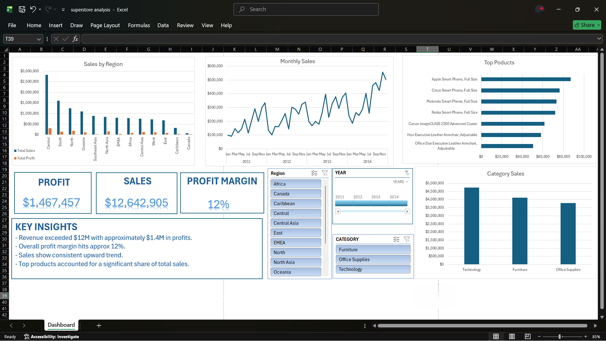

# Global Superstore Sales Dashboard (Excel)

## Overview

This project is an interactive sales dashboard built in Microsoft Excel using the Global Superstore dataset containing over 50,000 sales records from multiple countries and markets.

The dashboard provides insights into sales performance, profitability, customer segments, product categories, and regional trends through interactive visualizations and slicers.

## Dataset

The dataset contains approximately 51,000 records and includes:

- Orders and sales transactions
- Product categories and sub-categories
- Customer information
- Geographic information (country, region, state, city)
- Shipping details
- Profit and sales metrics
- Discounts and shipping costs

## Objectives

The dashboard was designed to answer key business questions such as:

- What is the total sales revenue and profit generated?
- Which product categories generate the most revenue?
- Which regions contribute the highest sales?
- What are the top-performing products?
- How do sales vary across different markets and regions?

## Dashboard Features

### KPI Cards

- Total Sales
- Total Profit
- Profit Margin

### Visualizations

- Sales by Category
- Sales by Region
- Top Performing Products
- Profitability Analysis

### Interactive Filtering

The dashboard includes slicers that allow users to dynamically filter results by:

- Year
- Market
- Category

## Tools Used

- Microsoft Excel
- Pivot Tables
- Pivot Charts
- Slicers
- Calculated Metrics
- Dashboard Design Techniques

## Key Insights

- Generated over **$12 million** in sales revenue.
- Produced approximately **$1.4 million** in profit.
- Certain product categories contributed significantly more revenue than others.
- Sales performance varied considerably across geographic regions.
- Interactive filtering revealed differences in customer and market behavior.

## Dashboard Preview

Add screenshots of the dashboard here.

## Skills Demonstrated

- Data Cleaning
- Data Analysis
- Business Intelligence Reporting
- Dashboard Design
- Excel Visualization
- Pivot Table Analysis
- KPI Development
